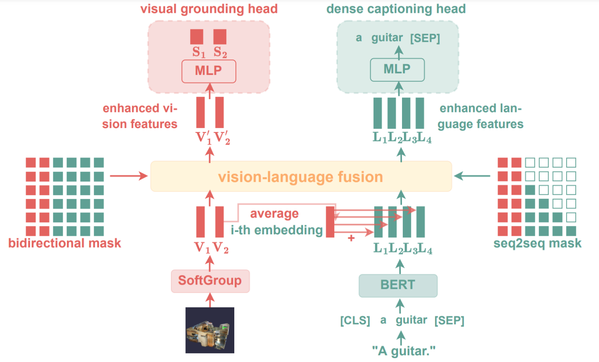
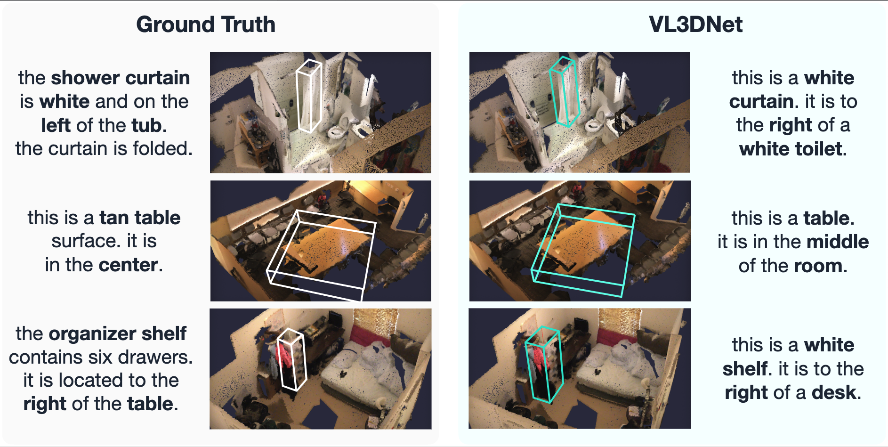
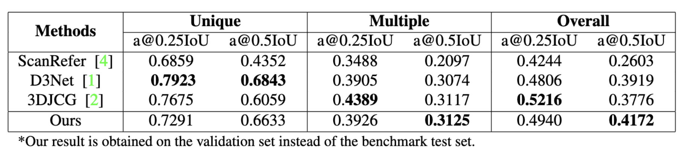
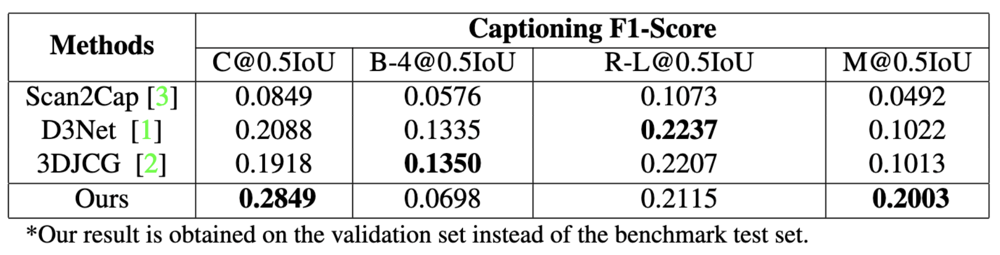

# Joint Architecture for 3D Vision Language

A full transformer-based joint architecture for the visual grounding and dense captioning task.



## Introduction

3D visual grounding and 3D dense captioning are similar in that they both require an understanding of crossmodality relationships. Previous attempts to jointly solve these tasks have not fully exploited these relationships, instead only superficially enhancing one modality with the other. We propose a novel approach, VL3DNet, for jointly solving these two tasks. Our method utilizes a shared vision-language transformer module to enhance the vision and language modalities simultaneously, effectively exploiting the intermodal relations. Compared to previous attempts, such as D3Net and 3DJCG, our method has significant improvement in visual grounding and dense captioning.

## Requirements

- python>=3.10.6
- cuda>=11.6


## Implementation Details

In this project, we utilized the following libraries and tools:

1) [Pytorch (v1.13.1)](https://pytorch.org/): A powerful machine learning library for building and training deep learning models.
2) [Pytorch-Lightning (v1.9.0)](https://www.pytorchlightning.ai/): A high-level library for Pytorch that simplifies model implementation and training.
3) [Transformers (v4.25.1)](https://huggingface.co/): A collection of pre-trained language models for NLP tasks.
4) [Hydra (v1.3.1)](https://hydra.cc/): A library for managing complex experiments and configurations.
5) [Optuna (v2.10.1)](https://optuna.org/): A library for hyperparameter optimization.
6) [WandB (v0.13.9)](https://wandb.ai/): A tool for logging, visualizing, and managing deep learning experiments.


## Scripts

There are different options to run the project. Because we use hydra we can changee the configurations
for the different training/prediction modes via cli.

### Data Preperation

To get the preprocessed data from softgroup please contact us.
After you get access to the datasets please put them into the data folder like this.

```batch
data
├── scanrefer
│   ├── ScanRefer_filtered.json
│   ├── ScanRefer_filtered_train.json
│   ├── ScanRefer_filtered_train.txt
│   ├── ScanRefer_filtered_val.json
│   └── ScanRefer_filtered_val.txt
└── softgroup
    ├── train
    │   ├── scene0000_00.pth
    │   ├── scene0001_00.pth
    │   ├── ...
    └── val 
        ├── scene0000_00.pth
        ├── scene0001_00.pth
        └── ...
```

### Training

For training there are several options you can choose, depending on the task you want to train on or 
which task you want to finetune.

To train the visual grounding task just use:

```bash
. scripts/train_grounding.sh
```

To train the dense captioning task just use:

```bash
. scripts/train_captioning.sh
```

To train both tasks jointly use:

```bash
. scripts/train_vl3dnet.sh
```

### Evaluating

For evaluating there are several options you can choose.

To evaluate the visual grounding task just use:

```bash
. scripts/eval_grounding.sh
```

To evaluate the dense captioning task just use:

```bash
. scripts/eval_captioning.sh
```

To evaluate both tasks jointly use:
```bash
. scripts/eval_vl3dnet.sh
```

### Hyparams Search

```bash
python train.py +hparams_search=optuna
```

## Results



## Benchmark

The benchmark for the visual grounding task:



The benchmark for the dense captioning task:



## Checkpoints

To get the checkpoints from vl3dnet download them via the provided [link](https://drive.google.com/file/d/1O0yPXXmQ088JBF7tNChJNU8DsEbXWosj/view?usp=share_link).
After you get access to the checkpoints please put them into the checkpoints folder like this.

```batch
checkpoints
├── best/mode=0-val_loss="...".ckpt 
├── best/mode=0-val_loss="...".yaml
├── best/mode=1-val_loss="...".yaml
├── best/mode=1-val_loss="...".yaml
├── best/mode=2-val_loss="...".yaml
└── best/mode=2-val_loss="...".yaml
```

## License

Copyright (c) 2023 [Yaomengxi Han](https://github.com/Maxcharm), Robin Borth
